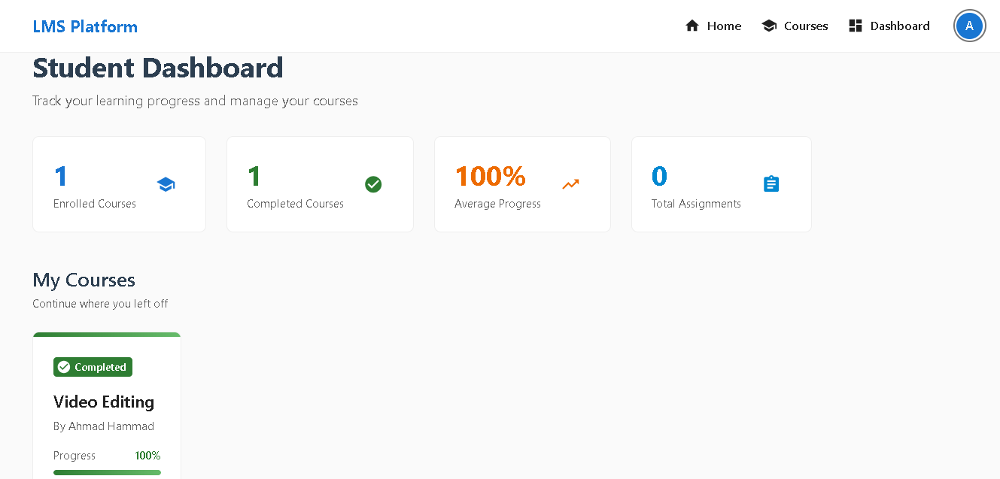
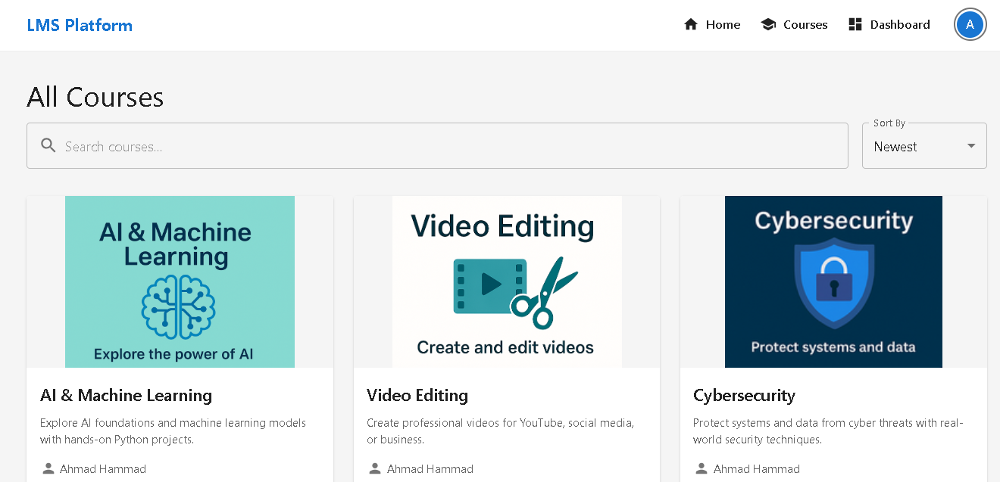
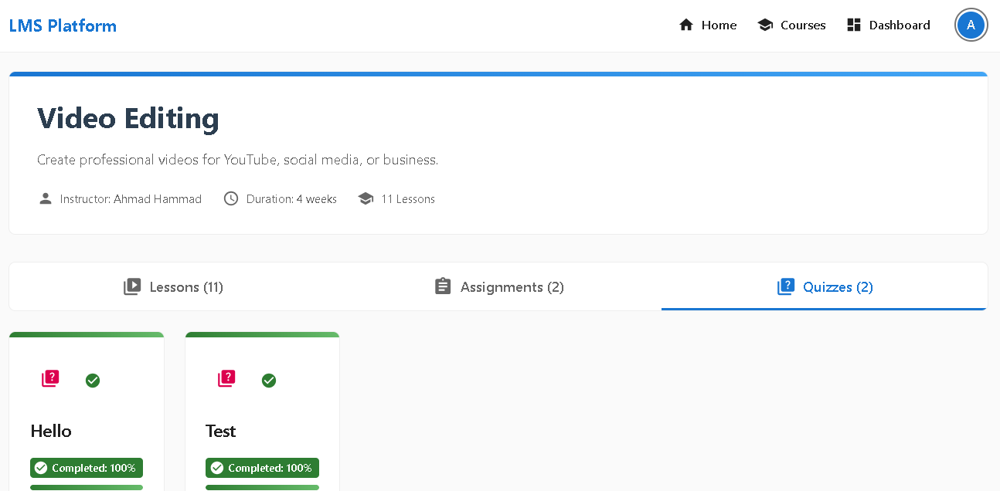

# 🎓 LMS Frontend

A fully responsive, role-based frontend interface for a complete Learning Management System (LMS) built using **React.js** and **Material UI**.  
This frontend connects seamlessly with the [LMS Backend API](https://github.com/ahmadh9/lms-backend-api) and supports multiple user roles: `student`, `instructor`, and `admin`.

---

## 🚀 Overview

The LMS frontend delivers all features expected from a professional e-learning platform:

- Dynamic role-based dashboards
- Course browsing and enrollment
- Lesson navigation and completion tracking
- Interactive quizzes and assignment submissions
- Instructor course creation and grading tools
- Admin control panels

Built using modern React patterns (hooks, context, modular services), the app is designed for maintainability, performance, and scalability.

---

## 👥 Supported Roles

### 🧑‍🎓 Student
- Enroll in courses
- View lessons
- Submit assignments and quizzes
- Track progress in real-time

### 🧑‍🏫 Instructor
- Create and manage courses
- Upload lessons (video link, text, or file)
- Review and grade student submissions

### 🛠️ Admin
- Approve or reject courses
- Manage users and categories
- View platform-wide analytics

---

## 🧩 Tech Stack

| Layer       | Technology                   |
|-------------|------------------------------|
| Frontend    | React.js (Create React App)  |
| UI Library  | Material UI (MUI v5)         |
| Routing     | React Router DOM             |
| State Mgmt  | React Context + useState     |
| HTTP        | Axios                        |
| Auth Flow   | JWT + Google OAuth           |
---

## 🗂️ Project Structure

```plaintext
📁 lms-frontend/
├── 📁 public/
│   └── index.html                 ← main HTML shell
├── 📁 src/
│   ├── pages/                     ← route-level components (Dashboard, UsersManagement, etc)
│   ├── components/                ← reusable UI components
│   ├── services/                  ← API service layer
│   │   ├── api.js                 ← Axios instance with base config
│   │   ├── authService.js         ← login, logout, register, token
│   │   ├── courseService.js       ← fetch/create/update courses
│   │   ├── enrollmentService.js   ← enrollment actions and progress
│   │   ├── progressService.js     ← track module/lesson completion
│   │   └── quizService.js         ← quiz fetching and submission
│   ├── context/                   ← global context (auth/role state)
│   ├── App.js                     ← main React app wrapper
│   └── index.js                   ← ReactDOM render entry
├── 📁 screenshots/                ← images used in README
│   ├── student-dashboard.png
│   ├── courses-page.png
│   ├── quiz-tab.png
│   └── admin-dashboard.png
├── .gitignore
├── package.json
├── README.md
└── .env.example                   ← environment variable sample
```


---

## 📸 Sample Screenshots

### 🧑‍🎓 Student Dashboard


### 📚 Courses Page


### ❓ Quiz Tab (Student)


### ⚙️ Admin Dashboard


---

## 🔑 Key Features

### 🧭 Navigation & Layout
- Clean responsive layout
- Protected routes per role
- Auto-updated navigation bar

### 📚 Courses & Lessons
- Browse courses by category
- Enroll and track progress
- Modular structure (Modules → Lessons)
- Video support (YouTube, .mp4, or links)

### 📝 Assignments & Quizzes
- Interactive quiz pages
- Auto-graded quizzes
- File upload for assignments
- Instructor feedback

### 🛡️ Authentication
- Google OAuth & Email/Password login
- JWT-based protection
- Role-based UI rendering

---

## 🛠️ Setup Instructions

```bash
# 1. Clone the project
git clone https://github.com/ahmadh9/lms-frontend.git
cd lms-frontend

# 2. Install dependencies
npm install

# 3. Create a .env file in the root directory

REACT_APP_API_URL=http://localhost:5000/api

# 4. Run the development server
npm start

📝 Make sure to restart the dev server after editing the .env file.

🌐 API Dependency

This project depends on the backend API:

👉 LMS Backend API GitHub Repo
✨ Deployment Tips

    Ensure CORS is enabled for frontend domain

    Set VITE_API_URL correctly for production

    Recommended deployment: Vercel or Netlify

👨‍💻 Developed by Ahmad Hammad

📧 ahmadkhammad95@gmail.com
🐙 GitHub: @ahmadh9
